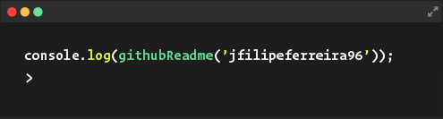

 

    

<h1 align="center">Welcome, I'm Filipe from Portugal</h1>

## 🙋‍♂️ About Me

- 🖥️ I’m currently working as a **React/Next.js & Node.js Dev at [i-charging S.A.](https://i-charging.pt/)**

- 👨‍💻 You can check my Personal Website at **[My Website](https://jfilipeferreira96.github.io/personal-website/)**

- 🌐 I am keen to improve my knowledge of all things web-related.

<!-- - 📫 How to reach me **filipeferreira96@hotmail.com**
 -->

## 🚀 Languages and Tools:

    
    
    
    
    
    
    
    
    
    
    
    
    
    

 

    
     

 
 

## 📫 How to reach me:

    
        
        

 
